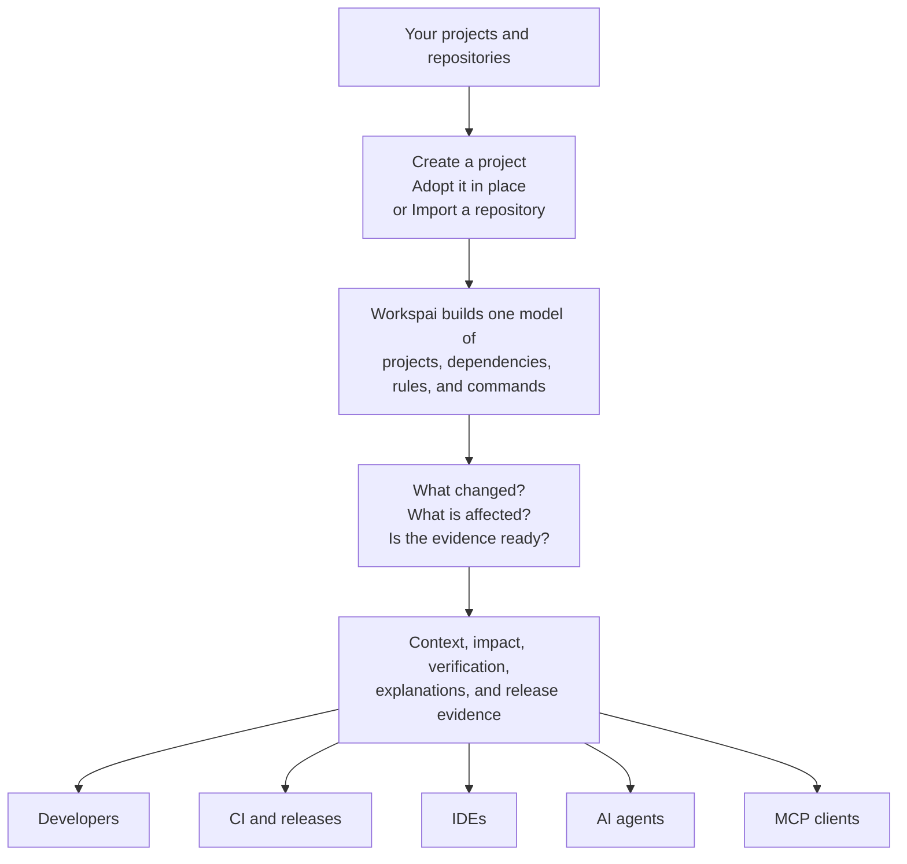

# From Code to Shared Understanding

Workspai gives everyone the same understanding of your software, without asking
you to replace your frameworks or move existing source code.



## What This Means

1. **Connect your software.** Create something new, adopt an existing project
   without moving it, or import a repository.
2. **Understand the workspace.** Workspai builds one model of the projects and
   how they relate.
3. **Understand change and verify it.** Workspai shows affected areas and checks
   the evidence needed for a safe decision.
4. **Share the result.** Developers, CI, IDEs, AI agents, and MCP clients consume
   the same workspace truth instead of building separate assumptions. The
   current CLI exposes a read-mostly `workspace mcp serve` bridge; a dedicated
   `packages/mcp` boundary is planned.

This is the user-facing view. The implementation uses a versioned chain of
model, change, evidence, verification, context, grounding, and explanation
steps. Contributors and integrations can inspect the complete contracts:

- [`workspace-intelligence-chain.v1.json`](../contracts/workspace-intelligence-chain.v1.json)
- [`workspace-intelligence-architecture.v1.json`](../contracts/workspace-intelligence-architecture.v1.json)

The unified runner also has a deterministic execution envelope: `sync` runs
before Model and baseline resolution runs after Model/before Diff. These appear
as two `preflight` entries, not as extra chain stages. The 11 canonical stages,
baseline lifecycle, exit codes, and failure propagation are specified in
[Unified Workspace Intelligence Runner](./workspace-intelligence-runner.md).

The npm README uses a PNG rendering because npm package pages do not reliably
render Mermaid. When this source changes, regenerate
`From Code to Shared Understanding.png` before publishing.

## Execute the Contract

Run the complete canonical chain in its versioned order:

```bash
npx workspai workspace intelligence run --for-agent codex --json
```

For enterprise CI and release enforcement, add `--strict`. A warning or
needs-attention verdict then produces a blocked report and exit code `2`:

```bash
npx workspai workspace intelligence run --for-agent codex --strict --json
```

`pipeline` is the broader governance/release orchestrator. It does not replace
or reorder the canonical Workspace Intelligence chain.
