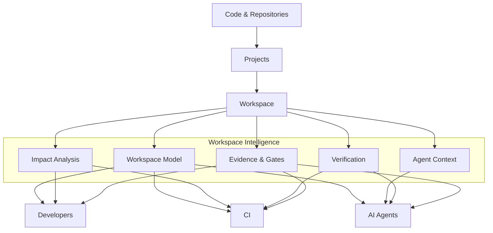

# From Code to Shared Understanding

How Workspai transforms projects and repositories into workspace intelligence for developers, CI, and AI agents.

This Mermaid diagram is kept in the internal documentation because GitHub renders it correctly. The main npm README uses a PNG version of the same diagram so it remains visible on npm package pages.

